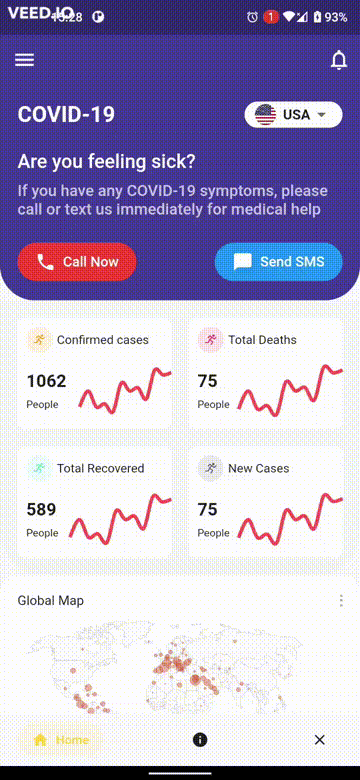
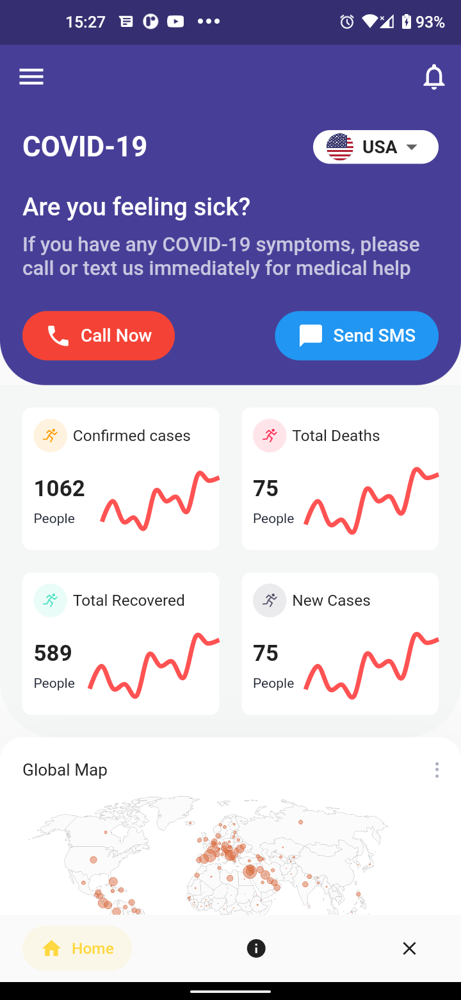
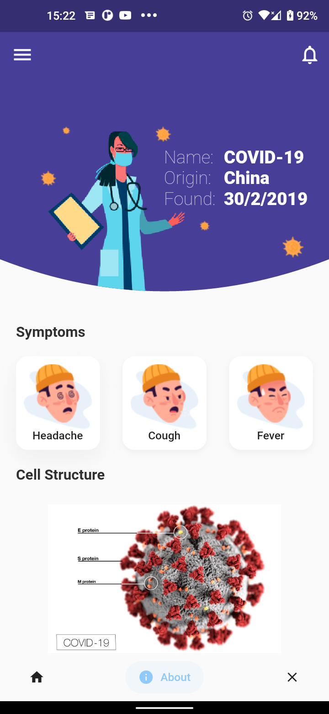
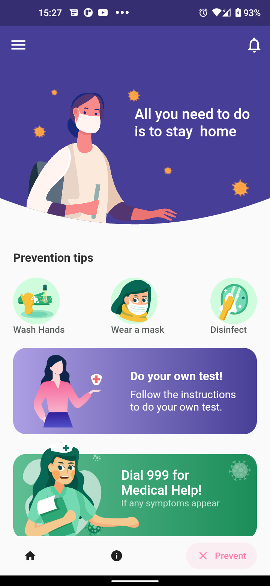

<div id="top"></div>
<!--
*** Thanks for checking out the Best-README-Template. If you have a suggestion
*** that would make this better, please fork the repo and create a pull request
*** or simply open an issue with the tag "enhancement".
*** Don't forget to give the project a star!
*** Thanks again! Now go create something AMAZING! :D
-->


<!-- PROJECT SHIELDS -->
<!--
*** I'm using markdown "reference style" links for readability.
*** Reference links are enclosed in brackets [ ] instead of parentheses ( ).
*** See the bottom of this document for the declaration of the reference variables
*** for contributors-url, forks-url, etc. This is an optional, concise syntax you may use.
*** https://www.markdownguide.org/basic-syntax/#reference-style-links
-->
[![Contributors][contributors-shield]][contributors-url]
[![Forks][forks-shield]][forks-url]
[![Stargazers][stars-shield]][stars-url]
[![Issues][issues-shield]][issues-url]
[![MIT License][license-shield]][license-url]
[![LinkedIn][linkedin-shield]][linkedin-url]


<!-- PROJECT LOGO -->
<br />
<div align="center">
  <a href="">
    
  </a>

  <h3 align="center">Flutter Project</h3>

  <p align="center">
    Covid app with an awesome UI
    <br />
    <!-- <a href="https://github.com/othneildrew/Best-README-Template"><strong>Explore the docs »</strong></a> -->
    <br />
    <br />
    <!-- <a href="https://github.com/othneildrew/Best-README-Template">View Demo</a>
    ·
    <a href="https://github.com/othneildrew/Best-README-Template/issues">Report Bug</a>
    ·
    <a href="https://github.com/othneildrew/Best-README-Template/issues">Request Feature</a> -->
  </p>
</div>


<!-- TABLE OF CONTENTS -->
<details>
  <summary>Table of Contents</summary>
  <ol>
    <li>
      <a href="#about-the-project">About The Project</a>
      <ul>
        <li><a href="#built-with">Built With</a></li>
      </ul>
    </li>
    <li>
      <a href="#getting-started">Getting Started</a>
      <ul>
        <li><a href="#prerequisites">Prerequisites</a></li>
        <li><a href="#installation">Installation</a></li>
      </ul>
    </li>
    <li><a href="#usage">Usage</a></li>
    <li><a href="#roadmap">Roadmap</a></li>
    <li><a href="#contributing">Contributing</a></li>
    <li><a href="#license">License</a></li>
    <li><a href="#contact">Contact</a></li>
    <li><a href="#acknowledgments">Acknowledgments</a></li>
  </ol>
</details>


<!-- ABOUT THE PROJECT -->
## About The Project








My goal with this project was to combine everything I have learned to build a fully functional, realistic and scalable Flutter app.


<p align="right">(<a href="#top">back to top</a>)</p>


### Built With

Frameworks, libraries and dependencies for this project

* [Flutter](https://flutter.dev/) (Main framework used)
* [Freezed](https://pub.dev/packages/freezed) (Data modelling library)
* [Autoroute](https://pub.dev/packages/auto_route) (Navigation library)
* [fl_chart](https://pub.dev/packages/fl_chart) (Chart library)
* [flutter_bloc](https://bloclibrary.dev/#/) (Main state management library)
* [flutter_svg](https://pub.dev/packages/flutter_svg) (Rendering svg pictures)
* [get_it](https://pub.dev/packages/get_it) (Service lovator for dependency injection )
* [injectable](https://pub.dev/packages/injectable) (Dependency injection library)
* [salomon_bottom_bar](https://pub.dev/packages/salomon_bottom_bar) (Bottom navigation bar library)

<p align="right">(<a href="#top">back to top</a>)</p>


<!-- GETTING STARTED -->
## Getting Started

Instructions on how to build the app

### Prerequisites

* [setup Android](https://developer.android.com/studio)

* [Dart](https://dart.dev/)

* [Flutter](https://flutter.dev/)


### Installation

_How to install the app._

1. Clone the repo
   ```sh
   git clone https://github.com/your_username_/Project-Name.git
   ```
2. Install Flutter dependencies (Pre-installed in `pubspec.yaml`)
   ```dart
   flutter pub get
   ```
3. Generate dpendency class
   ```dart
   flutter pub run build_runner build --delete-conflicting-outputs
   ```

<p align="right">(<a href="#top">back to top</a>)</p>


<!-- USAGE EXAMPLES -->
## Usage

Project can be used as a reference for building scalable apps and real-world apps.
App features:
 * Retrieves data from an API
 * Null-safety 
 * Proper implementation of dependency injection
 * Domain-Driven-Design Architecture
 * Flutter Bloc State management
 * Data Transfer Objects
 * Navigation and routing
  

<p align="right">(<a href="#top">back to top</a>)</p>


<!-- ROADMAP -->
## Roadmap

- [x] Project structure setup
- [x] Infrastructure layer (API)
- [x] Domain layer (Models and reposiory facade)
- [x] Application layer (Implement state management (Bloc))
- [x] Presentation layer (setup UI)
- [ ] Link application layer to domain
- [ ] Render dynamic chart content
- [x] Documentation
- [ ] Multi-language Support
    - [ ] Chinese
    - [ ] Spanish

See the [open issues](https://github.com/ferdinandmwal123/flutter_proj/issues) for a full list of proposed features (and known issues).

<p align="right">(<a href="#top">back to top</a>)</p>


<!-- CONTRIBUTING -->
## Contributing

Contributions are what make the open source community such an amazing place to learn, inspire, and create. Any contributions you make are **greatly appreciated**.

If you have a suggestion that would make this better, please fork the repo and create a pull request. You can also simply open an issue with the tag "enhancement".
Don't forget to give the project a star! Thanks again!

1. Fork the Project
2. Create your Feature Branch (`git checkout -b feature/AmazingFeature`)
3. Commit your Changes (`git commit -m 'Add some AmazingFeature'`)
4. Push to the Branch (`git push origin feature/AmazingFeature`)
5. Open a Pull Request

<p align="right">(<a href="#top">back to top</a>)</p>


<!-- LICENSE -->
## License

Distributed under the MIT License. See `LICENSE.txt` for more information.

<p align="right">(<a href="#top">back to top</a>)</p>


<!-- CONTACT -->
## Contact

<!-- Your Name - [@your_twitter](https://twitter.com/your_username) - email@example.com -->

Project Link: [https://github.com/ferdinandmwal123/flutter_proj](https://github.com/ferdinandmwal123/flutter_proj)

<p align="right">(<a href="#top">back to top</a>)</p>


<!-- ACKNOWLEDGMENTS -->
## Acknowledgments

Resources used to develop this project

* [Flutter Bloc Tutorial for Beginner (Video)](https://www.youtube.com/watch?v=Ep6R7U9wa0U)
* [Flutter Firebase & DDD  (Video)](https://www.youtube.com/watch?v=KfuUkq2cLZU&list=PLB6lc7nQ1n4iS5p-IezFFgqP6YvAJy84U&index=10)
* [Flutter Native Splash (Video)](https://www.youtube.com/watch?v=dB0dOnc2k10)
* [Dartz Using Either (Article)](https://halesworth.org/dartz-using-either/)
* [Using freezed with Bloc (Article)](https://poetryincode.dev/dash-tips-using-freezed-with-bloc)
* [Flutter - bloc with freezed (Article)](https://www.codementor.io/@sunilmishra/flutter-bloc-with-freezed-16cjssmd9i)
* [Flutter Bloc (v8.0.1) Pattern to load API data with Freezed and AutoRoute (Article)](https://medium.com/@CodingWithImran/flutter-bloc-v8-0-1-pattern-to-load-api-data-with-freezed-and-autoroute-ab88a27ce273)
* [React Icons](https://react-icons.github.io/react-icons/search)
* [API used](https://api.covid19api.com/summary)
* [Networking in Flutter using Dio (Article)](https://blog.logrocket.com/networking-flutter-using-dio/)
* [Data Modeling with Flutter using freezed package (Article)](https://dev.to/carlomigueldy/data-modeling-with-flutter-using-freezed-package-4p69)
* [News app (Repository)](https://github.com/LoaiZewail/news-app)
* [Covid 19 App Flutter UI (Video)](https://www.youtube.com/watch?v=zx6uMCoW2gQ)
* [Flutter Covid 19 Dashboard UI (Video)](https://www.youtube.com/watch?v=krU-ASLb8lM)
* [Covid 19 App- Flutter UI (Video)](https://www.youtube.com/watch?v=axWBN1aotQk)

<p align="right">(<a href="#top">back to top</a>)</p>


<!-- MARKDOWN LINKS & IMAGES -->
<!-- https://www.markdownguide.org/basic-syntax/#reference-style-links -->
[contributors-shield]: https://img.shields.io/github/contributors/ferdinandmwal123/flutter_proj
[contributors-url]: https://github.com/ferdinandmwal123/flutter_proj/graphs/contributors
[forks-shield]: https://img.shields.io/github/forks/ferdinandmwal123/flutter_proj?style=social
[forks-url]: https://github.com/ferdinandmwal123/flutter_proj/network/members
[stars-shield]: https://img.shields.io/github/stars/othneildrew/Best-README-Template.svg?style=for-the-badge
[stars-url]: https://github.com/ferdinandmwal123/flutter_proj/stargazers
[issues-shield]: https://img.shields.io/github/issues/ferdinandmwal123/flutter_proj
[issues-url]: https://github.com/ferdinandmwal123/flutter_proj/issues
[license-shield]: https://img.shields.io/github/license/ferdinandmwal123/flutter_proj
[license-url]: https://github.com/ferdinandmwal123/flutter_proj/blob/main/LICENSE
[linkedin-shield]: https://img.shields.io/badge/-LinkedIn-black.svg?style=for-the-badge&logo=linkedin&colorB=555
[linkedin-url]: https://www.linkedin.com/in/ferdinand-mwalagho-091436198/

